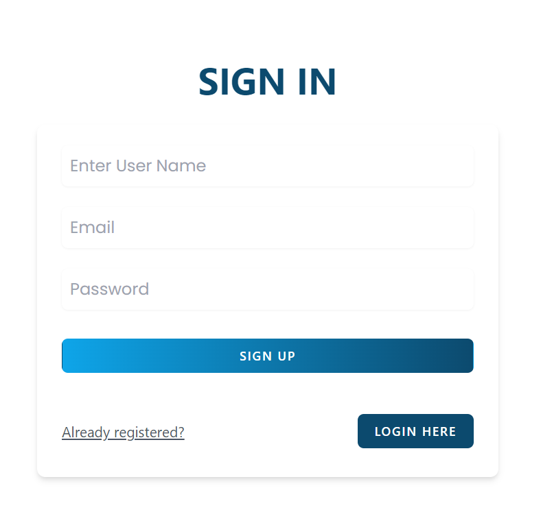
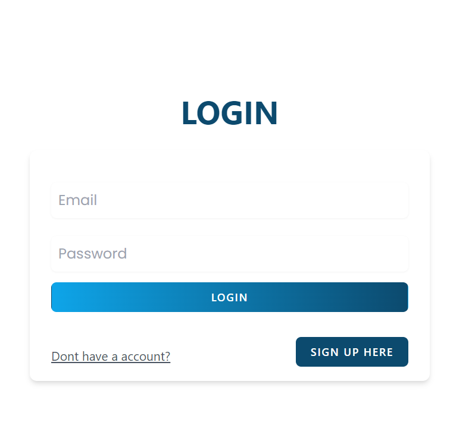
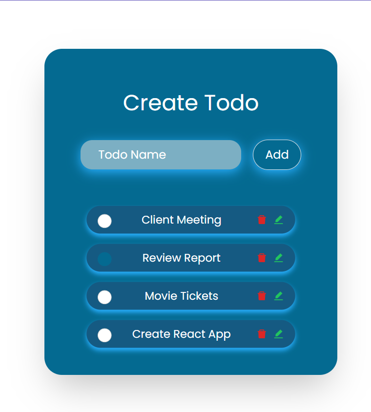

# Todo App

A MERN stack based web application, where users can register, login, create and manage their todos.

## Features

- User registration and login
- Create, edit, mark as completed and delete todos
- Logout option

## Technical Stack

- MongoDB
- Express.js
- React
- Node.js

## Requirements

- Node.js
- MongoDB Atlas account

## SIGNIN
 

## LOGIN
 

 ## Home
 

## Live Link:

[LIVE](https://surya-todo-app.netlify.app)

